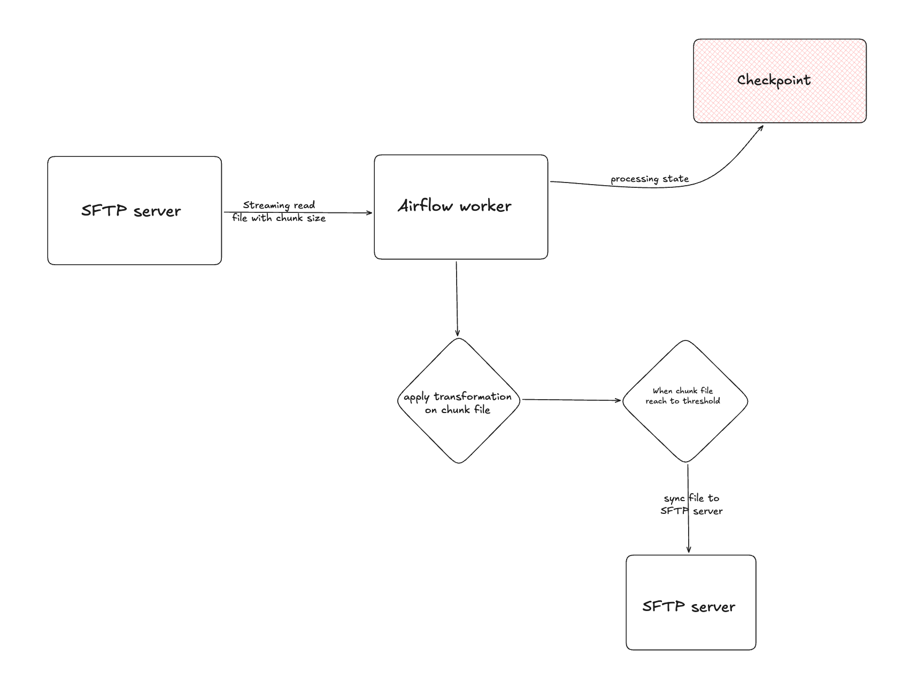
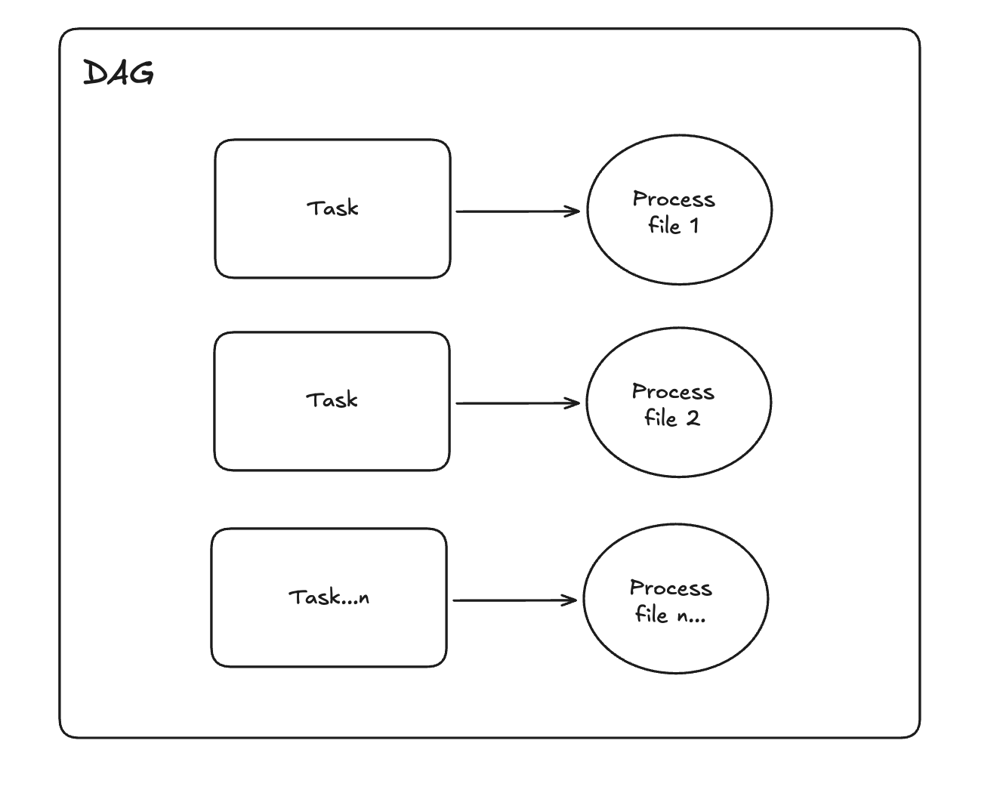
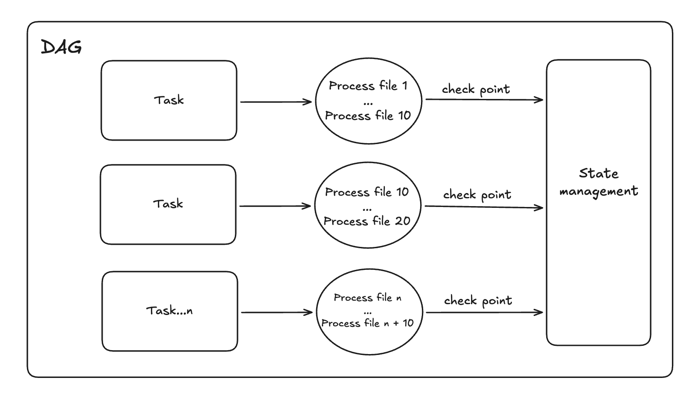

# Cake Test

## Table of Contents
- [Requirements Analysis](#requirements-analysis)
- [Assumptions and Design Decisions](#assumptions-and-design-decisions)
- [What I will do?](#what-I-will-do)
- [Work Around](#work-around)
- [Finalize](#finalize)
- [Setup and running](#setup-and-running)


## Requirements Analysis

### Test Requirements
1. Unidirectional Sync => Which means any modification made on target must not impact the source.
2. Directory Structure Preservation => Which means Maintain the same folder hierarchy on target as exists on source => Ex: a file named **sftp://source/a/b/c/file_2.txt** appears on the source server and subsequently should be transferred to **sftp://target/a/b/c/file_2.txt** on the destination server
3. Non-Destructive Target => Which means Files deleted from source must remain on target
4. Extendable => Which means the source sync operator should not be limited to SFTP; it should also support Object Storage and be easy to adapt to other storage backends
5. Extensibility => Which means it should be easy to add transformations between Extract (E) and Load (L) stages in the pipeline? but should be think about how complicated of transformation when data on fly stream from source to server?
6. Anomalies Handling => Which means we should think about worst-case scenarios when file sizes increase or the number of files increases 
7. Airflow Requirement:
   - Separate containers for Scheduler, Worker, and Web Server
   - Use Celery executor (multi-worker support)
   - SQLite backend is acceptable for this test
   - Airflow version? => version is not strictly require
8. Code Quality => Should be clean with abstraction, extensibility and easy to adapt
9. Scalability Considerations => Should think about when the file size increase, or the number of files becoming really large
10. Error handling => Should think about mechanism to keep the state of processing progress, for rollback/cleanup and rerun if needed?

## Assumptions and Design Decisions
Since the test requirements were not clearly aligned, I will base my design on the following assumptions

### Assumptions
1. **DAG Schedule Frequency** => Based on the examples provided in the problem statement (March 1st, 2nd, 3rd), I assume the DAG runs on a **daily schedule**.

2. **Input Structure and Versioning** => Each daily DAG run processes a date-versioned folder path that contains multiple .txt files (not just a single file). This prevents data overwrites from different time periods.

   **Example - Date-Versioned Structure (Our Assumption)**:
   ```
   source/
   ├── 2024-03-01/
   │   ├── dasdasd.txt
   │   ├── qwreqrwer.txt
   │   └── czxczxc.txt
   ├── 2024-03-02/
   │   ├── dasdasd.txt
   │   ├── qwreqrwer.txt
   │   └── czxczxc.txt
   └── 2024-03-03/
       ├── dasdasd.txt
       ├── qwreqrwer.txt
       └── czxczxc.txt
   ```

   **Daily DAG Run Behavior**:
   - March 1st DAG run: Processes `source/2024-03-01/` → Transfers all .txt files to `target/2024-03-01/`
   - March 2nd DAG run: Processes `source/2024-03-02/` → Transfers all .txt files to `target/2024-03-02/`
   - March 3rd DAG run: Processes `source/2024-03-03/` → Transfers all .txt files to `target/2024-03-03/`

   **Assumptions**:
   - The source files are already organized in a date-partitioned directory structure (`YYYY-MM-DD/`)
   - Files are uniquely identified by their full path (directory + filename)
   - Re-running the March 1st DAG won't overwrite March 2nd data because they're in separate directories
   - The same filename (e.g., `dasdasd.txt`) in different date folders are treated as completely different files


## What I will do?

### 1. Research about SFTP server
Currently, I never work with SFTP server, but the first assumption will be that the server will support some API for CRUD file? Like we can list files in specific folder, retrive files, transfer file, folder with supported method (batch, stream read/transfer)?

### 2. Set Up Airflow with Docker Compose
- Deploy Airflow with separate containers: **Scheduler**, **Worker** (Celery executor), **Web Server**
- Use SQLite as metadata database and Redis as message broker for Celery

### 3. Airflow Hook
So we need a hook for connect to the SFTP server? If airflow already support the hook we could use it or implement the wrapper on top of it if we have some additional requirements arise like custom connection pooling or retry logic?

However, if Airflow not already support built-in hook, we can inherit from the HTTPbase hook to connect to the server and implement some needed function for CRUD files in specific path

### 4. Implement Custom Operator with Factory Design Pattern
Because at the requirements, we focus on the **Extendable** which means it could be not just a SFTP server, maybe we use another storage server also. So I will come up with some Factory design pattern for easily extend to new storage server type

### 5. Implement DAG with Daily Schedule
- Create the DAG using the custom operator we already implemented
- Schedule: `@daily` (runs once per day at midnight, etc...)


## Work Around
So we could work around each component first, plan for what we will do/implement, the solution we could have and follow up with it

### Custom Operator Work Around

Based on the test requirements, we need to address several design concerns:

1. The custom operator should accept either a **list of files** or a **single file** (as a list with one element) => This allows the operator to work flexibly with different DAG strategies

2. The test requires extensibility to add transformations between Extract and Load stages => We may need to sync the file from **source server → worker**, apply transformations on the worker, then sync from **worker → target server**

3. But from the perspective 2, what if the file is several GB and causes OOM (Out of Memory) errors when loaded entirely into the worker? => We could be need implement **streaming/chunked processing** - read the file from SFTP in chunks (e.g., 10MB blocks), process each chunk incrementally, apply trasformation and stream write to the target. This ensures constant memory usage regardless of file size.

4. But from perspective 3, we streaming read the file from SFTP in chunks, apply transformation on each chunk => So the transformation should be some simple mapping instead of complex transformation like aggregate data? If it contains aggregate data we should think about temporary storage for aggregate result before flush into SFTP server

4. If we fail in the middle of transferring a file, we need to prevent duplicate file when resync => Maybe like the atomic transaction where we will have logic for rollback/cleanup file not success on target server

5. When processing files sequentially, if we fail on file #50 out of 100, we don't want to re-sync files 1-49 => Maybe we need to have **checkpointing** by marking each file immediately after successful transfer? On re-run, the operator queries the state and skips already-synced files, resuming from the failure point.

6. The custom operator need to be flexible not only for SFTP server, maybe other storage servers also => Maybe we will need a factory design pattern for easily add-in storage servers

So the flow coubd be simple like components below:



---

### DAG Setup - Work Around
So after we already have the hook, operator => we would plan for how we will design the DAG for running every day to get the needed files

### Solution 1:

The first thing come to my mind that I would sequential single task processing which means single task will list & transfer all files

**What the flow look like?**


1. We will init task which input will be the source path? (e.g., `source/2024-03-01/`)
2. Then in our operator design above it will lists all files from the source folder
3. The operator loops through the list and transfers files one by one sequentially with streaming/chunked processing as we aligned above
4. The operator support checkpoint file level, the state management we could use Xcom? => which means if we fail in the middle of transfering a file, we will rollback/cleanup coresponding file in server and rerun the file later

**What we should concern?**:
1. Will this way reach the SLA? => Files transfer one at a time means slower complete, and we can miss the SLA
2. Not efficient enough for handle failure? => If the task fails, the entire batch stops

**Pros**:
- We can maintain resource for another DAG => I mean if our DAG just have single task for transfer file, another DAG can have resource in the pool for processing?
- We already have checkpoint logic in custom operator so re-runs skip already-synced files

**Cons**:
- Files transfer one at a time, slower for large file sets
- We may hit Airflow task timeout, SLA commitment when the folder contains many files
- If the task fails, the entire batch stops

**When we can use this approach?**:
- We know that files in folder will be the same for every day => Like just small number of files (eg. 10-20 files)
- If we have the SLA commitment for DAG, we need to ensure the number of files for processing should be small enough for not hitting the SLA
- When we want minimal complexity

### Solution 2:
The second solution come to my mind that what if we dynamic the task generation? Like one task per file

**What the flow look like?**



1. We could retrive the list of files first with SFTP hook
2. Then for each file we will generate dynamically one task per file
3. Each task independently transfers one file
4. Parallel execution based on worker availability
5. We dont need checkpoint anymore because the task already isolated, if it failed => custom operator will rollback/cleanup coresponding file in server and then we only need to re-run task

**What we should concern?**:
- How many files can we have (eg. 10, 100, 1000 files?) => It means 100, 1000 task per DAG => insane, we will exhausted resource of all others DAG. With celery executor without auto-scale node like KubeExecutor, all the task in pool will be exhausted for transfer files only
- Even if we have auto-scale the node for processing task => How much cost we would paid for just only transfer files?

**Pros**:
- We are trying to maximum parallelization => All files transfer simultaneously
- Each file visible as separate task, isolated so it could be easy for monitoring
- Failed files retry independently without affecting successful ones
- Not need checkpoint because we already isolated processing

**Cons**:
- Creating thousands of tasks has Airflow scheduler overhead
- Airflow UI will slow down with 1000+ tasks in single DAG run
- Many task instances create database pressure
- Task grows linearly with file count
- Company cost concern

**When we can use this approach**:
- Medium number of files (50-1000)
- Mixed file sizes
- Need visibility into individual file transfer status
- Sufficient worker resources for parallelization


### Solution 3:
Maybe this could be the final solution I am thinking, what if we group number of task into each batch? Like combine solution 1 + 2?

**What the flow look like?**



1. Base on solution 2 for generate task per file, now we can group the files into single task
2. Each task handle number of files base on threshold we predefined
3. Parallel execution number of tasks
4. The operator already supported checkpoint which we aligned above 

**What we should concern?**:
- Which threshold we use for efficiently grouping task to gether? fixed number, file size, etc..?
- Too many batches => overhead; Too few batches => no parallelization benefit

**Pros**:
- We could balanced the parallelization by adjust the threshold
- Faster than solution 1, and more control than solution 2
- Remain the performane of Airflow even with many files, and doesnt exhaust all worker resources like solution 2
- Scalable
- Operator's built-in checkpointing prevents re-syncing files within a batch on retry

**Cons**:
- Still facing with problem about task growth if we dont have a right threshold for grouping task together
- Complexity, must handle carefully if one file in batch fails
- Need to tune batch size based on file characteristics (count vs size)

**When we can use this approach**:
- When we have 1000+ files and solution 2 would create too many tasks
- When we need faster completion than Solution 1 but can't afford the overhead of Solution 2

### Future enhancemance
- Maybe we could think about parallel files processing inside a task? Like multi-threading strategy
- Good strategy when grouping files like small file could be transfer in batch or some stuff like that?

## Finalize
So I would come up with the solution 3 and follow the **What I will do** section that I have mentioned above

---

## Setup and Running

The instruction to start Airflow with Docker: **[Setup Guide](./documents/SETUP.md)**

So I have use claude for generating the SFTP server for testing, which can be configured at: **[Test](./tests/README.md)**